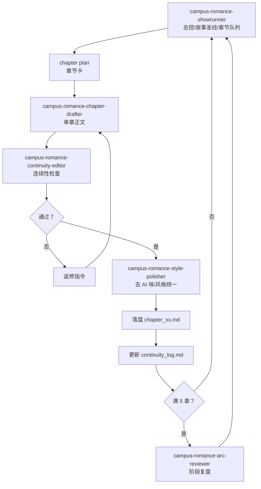
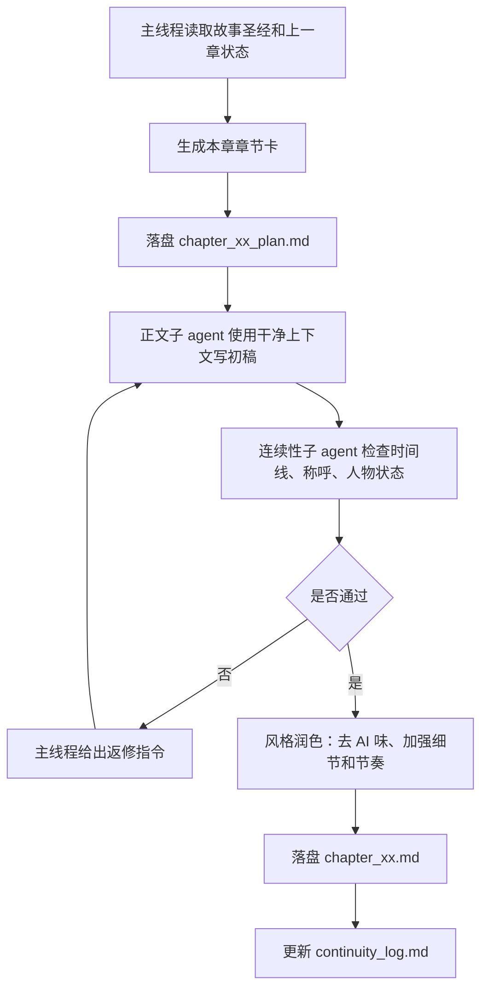

# 十万字校园言情小说生产工作流

## 项目定位

- 类型：高中校园言情
- 城市：温州
- 年代：约十年前
- 核心关系：两个班的英语课代表，因为经常在办公室碰面，从熟悉、试探、靠近到若即若离
- 主调：青春疼痛、酸涩、克制、真实，避免明显 AI 味
- 尺度边界：不写尺度过大的亲密描写，不把未成年恋爱写成猎奇或成人化关系
- 结尾：毕业后暑假结束，两人分别去不同大学，关系和人生方向留给读者思考

## 生产原则

1. 先定人物和关系曲线，再写章节。
2. 每章必须有一个具体的小事件，不能只写情绪。
3. 每章结尾保留下一章阅读动力：误会、问题、选择、未说出口的话、时间压力。
4. 所有甜都要有代价，所有疼都要有生活细节支撑。
5. 温州和十年前的时代感要自然渗入，不做资料堆砌。
6. 子 agent 只处理局部任务，主线程维护故事圣经和总线。

## 文件结构

- `planning/story_bible.md`：人物、关系、城市、学校、尺度、风格规则
- `planning/outline.md`：全书结构、分卷、章节目标
- `planning/chapter_template.md`：每章生成前使用的章节卡模板
- `skills/`：项目内小说生产 skills，可迁移到 Codex skill 目录
- `chapters/`：正文，每章一个文件
- `reviews/continuity_log.md`：连续性、伏笔、人物状态更新
- `reviews/arc_reviews.md`：每 5-10 章一次阶段复盘

## Skill 承载方案

本项目参考 `joeseesun/qiaomu-novel-generator` 的故事引擎、质量检查和去 AI 味机制，但改造成适合十万字长篇连载的多 skill 工作流。

| 环节 | Skill | 主要职责 |
| --- | --- | --- |
| 总控 | `skills/campus-romance-showrunner` | 维护故事圣经、总纲、生产节奏和子 agent 分工 |
| 单章写作 | `skills/campus-romance-chapter-drafter` | 根据章节卡写正文，确保每章有小事件和钩子 |
| 连续性 | `skills/campus-romance-continuity-editor` | 检查时间线、人物状态、伏笔、关系推进 |
| 文风润色 | `skills/campus-romance-style-polisher` | 去 AI 味，增强青春疼痛、酸涩和生活细节 |
| 阶段复盘 | `skills/campus-romance-arc-reviewer` | 每 5-10 章检查节奏、重复桥段和后续伏笔 |

## 单章生产流程

## 落盘频率

- 每个重要设定确认后，立刻更新 `story_bible.md`
- 每章生成前，落盘章节卡
- 每章正文完成后，立刻落盘正文
- 每 3-5 章，更新一次连续性日志
- 每 10 章，做一次结构复盘

## 子 agent 分工

- 章节计划子 agent：只负责把总纲拆成场景，不改核心设定
- 正文写作子 agent：只根据章节卡写正文，不擅自推进大事件
- 连续性检查子 agent：检查时间线、人物称呼、伏笔、情绪是否跳变
- 风格润色子 agent：减少模板感和解释腔，加强具体动作、对白、时代细节
